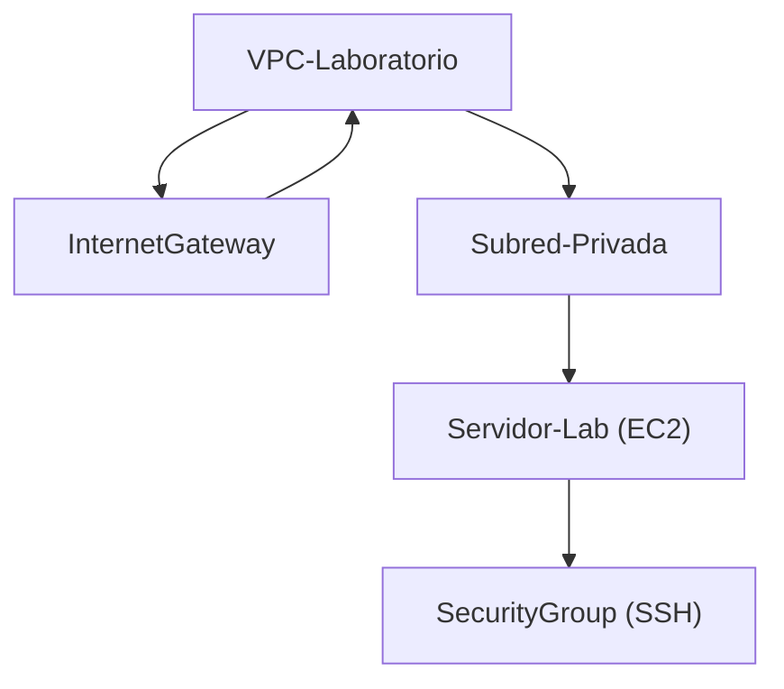
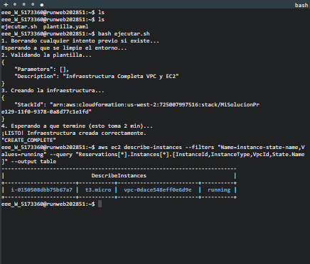

# AWS re/Start Infrastructure Challenge: VPC and EC2 Creation with CloudFormation


## Prerequisites

- AWS CLI installed and configured (pre-installed in the lab environment)
- Sufficient AWS permissions to create and delete VPC, EC2, and related resources
- Access to the provided AWS lab environment

This repository is organized for clarity and scalability:

- `docs/`: Documentation and architecture diagrams
- `templates/`: CloudFormation templates
- `scripts/`: Automation scripts

## Overview

This challenge guides you through the process of creating a complete AWS infrastructure using AWS CloudFormation. The goal is to design and deploy a template that provisions:

- An Amazon Virtual Private Cloud (VPC)
- An Internet Gateway attached to the VPC
- Security Groups configured to allow SSH access from anywhere
- A private subnet within the VPC
- An Amazon EC2 instance (t3.micro) within the private subnet

You will iterate on your solution until all components are successfully created. Notify your instructor once your template deploys without errors for a full review.


## Lab Environment and Resource Lifecycle

All resources are created in a temporary, sandboxed AWS environment. When the lab session ends, all resources are automatically destroyed. This ensures no ongoing costs or persistent resources. The purpose of this challenge is solely to demonstrate and back up your technical skills in a safe, ephemeral environment.

Access is strictly limited to the services required to build the specified infrastructure. Only use the necessary AWS resources to complete the challenge.

## Step-by-Step Instructions and Rationale

### 1. Start the Lab Environment
Begin by launching the lab environment. This provides temporary AWS credentials and access to the AWS Management Console and CLI.

**Why:** Ensures you are working in a controlled, isolated environment with the required permissions.

### 2. Access the AWS Management Console
Open the AWS Console in a new browser tab. If pop-ups are blocked, enable them to proceed.

**Why:** The console is used to visually verify resources and monitor CloudFormation stack creation.

### 3. Use the Terminal and AWS CLI
The provided terminal is preconfigured with AWS CLI and credentials. Example commands:

```bash
aws sts get-caller-identity
aws ec2 describe-instances
```

**Why:** The CLI allows you to query and validate resource creation programmatically.

### 4. Use the AWS SDK for Python (Boto3)
Python 3 and Boto3 are available for advanced scripting and automation:

```python
import boto3
ec2 = boto3.client('ec2', region_name='us-west-2')
ec2.describe_regions()
```

**Why:** Boto3 enables infrastructure automation and validation beyond the CLI.

### 5. CloudFormation Template Structure

Your template (see `templates/plantilla.yaml`) should include:

- **VPC**: Provides an isolated network environment.
- **Internet Gateway**: Enables outbound internet access for resources in the VPC.
- **VPC Gateway Attachment**: Connects the Internet Gateway to the VPC.
- **Private Subnet**: Segments the VPC for resource isolation.
- **Security Group**: Controls inbound SSH access (port 22) from any IP.
- **EC2 Instance**: Deploys a t3.micro instance in the private subnet.

**Why:** Each resource is essential for a secure, functional cloud environment. The VPC isolates resources, the subnet provides segmentation, the security group enforces access control, and the EC2 instance is the compute resource.

### 6. Iterative Testing
Deploy your CloudFormation template and verify each resource is created. Troubleshoot and refine until the stack completes without errors.

**Why:** Iterative testing ensures reliability and correctness of your infrastructure-as-code solution.


## Mermaid Architecture Diagram

The following Mermaid diagram illustrates the logical relationships and resource dependencies as defined in the CloudFormation template. This is useful for understanding the infrastructure-as-code logic and how each component interacts:



*Note: Mermaid diagrams may not render in all Markdown viewers. Use the image below for a graphical reference.*

## Architecture Diagram (Image)



*Diagram: This image illustrates the topological view of the VPC, subnet, Internet Gateway, security group, and EC2 instance. It is intended for visual presentations and documentation.*


## Example Output

### Template Validation
```
$ aws cloudformation validate-template --template-body file://templates/plantilla.yaml
{
	"Parameters": [],
	"Description": "Infraestructura Completa VPC y EC2"
}
```

### Stack Creation
```
$ aws cloudformation create-stack --stack-name MiSolucionPro --template-body file://templates/plantilla.yaml
{
	"StackId": "arn:aws:cloudformation:us-west-2:123456789012:stack/MiSolucionPro/abc123..."
}
```

### Stack Status
```
$ aws cloudformation describe-stacks --stack-name MiSolucionPro --query "Stacks[0].StackStatus"
"CREATE_COMPLETE"
```

### `templates/plantilla.yaml`
This file contains the AWS CloudFormation template that defines all required resources:

- **VPC**: Creates an isolated network (10.0.0.0/16) with DNS support.
- **InternetGateway**: Provides internet access to the VPC.
- **VPCGatewayAttachment**: Attaches the Internet Gateway to the VPC.
- **Subred**: Defines a private subnet (10.0.1.0/24) in the VPC.
- **SecurityGroup**: Allows SSH (port 22) from any IP for demonstration purposes.
- **InstanciaEC2**: Launches a t3.micro EC2 instance in the private subnet.

### `scripts/ejecutar.sh`
This Bash script automates the deployment process:

1. Deletes any previous CloudFormation stack with the same name to ensure a clean environment.
2. Validates the CloudFormation template for syntax and structure.
3. Creates the stack using the template.
4. Waits for stack creation to complete and outputs the final status.


**Note:** The script expects to be run from the repository root. It references the template in `templates/plantilla.yaml`.

## Manual Cleanup Instructions

If you need to manually delete the resources before the lab ends, run:

```
cd scripts
bash ejecutar.sh # The script will delete any previous stack before creating a new one
```

Or, to delete the stack only:

```
aws cloudformation delete-stack --stack-name MiSolucionPro
aws cloudformation wait stack-delete-complete --stack-name MiSolucionPro
```

## Additional Resources

- [AWS Training and Certification](https://aws.amazon.com/training/)
- [AWS CLI Command Reference](https://docs.aws.amazon.com/cli/latest/reference/)
- [Boto3 Documentation](https://boto3.amazonaws.com/v1/documentation/api/latest/index.html)

## Feedback

Your feedback is appreciated. Please use the [AWS Training and Certification Contact Form](https://www.aws.training/contact-us) for suggestions or corrections.


## Troubleshooting

**Template validation errors:**
- Ensure the YAML syntax is correct and all required properties are present.
- Use `aws cloudformation validate-template` to check for issues before deployment.

**Insufficient permissions:**
- Verify you are using the provided lab credentials.
- Ensure your IAM role has permissions for CloudFormation, EC2, and VPC actions.

**Stack creation fails:**
- Check the Events tab in the CloudFormation console for detailed error messages.
- Ensure no resource name conflicts exist from previous runs.

**Stack deletion fails:**
- Some resources may have dependencies or manual changes. Use the console to investigate and remove dependencies if needed.

This repository is for educational and demonstration purposes only. Consider adding a LICENSE file if you plan to share or reuse this code.

© 2022, Amazon Web Services, Inc. and affiliates. All rights reserved. This content may not be reproduced or redistributed without prior written permission from Amazon Web Services, Inc.